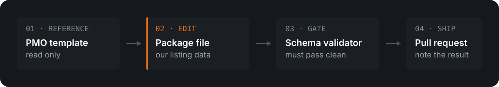

    

This repository holds the FedRAMP certification package overview for **CMMC Space**, the ATX Defense multi-tenant VDI service for handling CUI. The published JSON is what the FedRAMP Marketplace reads for our listing, so this repo is the source of truth for that listing.

## Files

| File | Purpose |
| --- | --- |
| `cmmc-space-fedramp-certification-package.json` | Our filled-out listing data. This is the file that gets published. |
| `fedramp-certification-package-overview.json` | The unmodified template published by the FedRAMP PMO. Reference for structure and field names. |
| `img/logo.png` | Listing logo, referenced by raw URL from the package file. Renaming or moving it breaks the listing. |

## Making a change

  

1. Edit `cmmc-space-fedramp-certification-package.json`. Use the PMO template for field names rather than inventing keys.
2. Paste the whole file into the [FedRAMP JSON Schema Validator](https://www.fedramp.gov/schemas/validator/?schema=fedramp-certification-package-overview-schema-2026-06-24.json).
3. Open a pull request and state in the description that the file validated cleanly.

> [!IMPORTANT]
> Validation is a merge gate. Any change to `cmmc-space-fedramp-certification-package.json` must pass the validator before it can be approved or merged.

## Contact

Sales questions go to <sales@atxdefense.com>. Security and FedRAMP questions go to <FedRAMP@atxdefense.com>.
